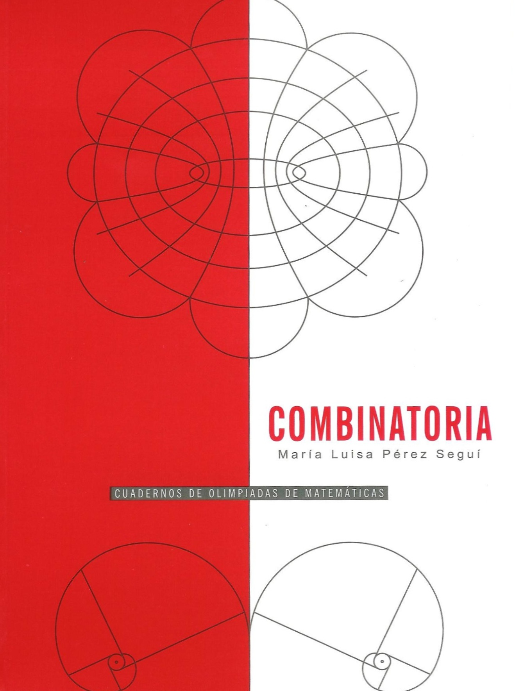

# Combinatoria

📚Cuadernos de olimpiadas de matemáticas 🗓2018 ℹ️Publicado

## Resumen
_Resumen próximamente._

## Metadatos
|  |  |
|---|---|
| **Autores** | Maria Luisa Pérez Seguí | 
| **Colección** | Cuadernos de olimpiadas de matemáticas | 
| **Año** | 2018 | 
| **Editorial** | Instituto de Matemáticas, UNAM | 
| **Edición** | 2 | 
| **ISBN (Colección)** | 978-968-36-8599-5 |

## Descargas
<a class="md-button" href = "cuad-x-1_mark.pdf" target = "_blank" rel ="noopener"> Abrir PDF </a>
<a class="md-button" href ="cuad-x-1_mark.pdf"download> Descargar</a>

 Ver en línea (vista previa)

<object data = "cuad-x-1_mark.pdf" type="application/pdf" width="100%" height="700">

 Tu navegador no puede mostrar PDF incrustado <a href="cuad-x-1_mark.pdf" target="_blank" rel ="noopener"> Abrir PDF </a> o usa el botón "Descargar".

</object>

!!! info "Aviso"
    Documento con marca de agua para distribución **digital**.

## Cómo citar
> Maria Luisa Pérez Seguí. (2018). *Combinatoria*. Instituto de Matemáticas, UNAM, 2

[Volver al catálogo](../catalogo.md)

[Explorar](../explorar.md)
