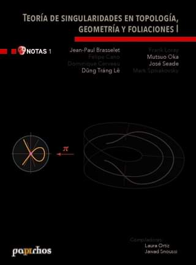

# Teoría de singularidades en topología, geometría y foliaciones

🏷Notas 📚Papirhos 🗓2017 ℹ️Publicado

## Resumen
_Resumen próximamente._

## Metadatos
|  |  |
|---|---|
| **Autores** | Jean-Paul Brasselet, Felipe Cano, Dominique Cerveau, Dung Tráng Lê, Frank Loray, Mutsuo Oka, José Seade, Mark Spivakovsky | 
| **Colección** | Papirhos | 
| **Serie** | Notas | 
| **Año** | 2017 | 
| **Editorial** | Instituto de Matemáticas, UNAM | 
| **Edición** | 1 | 
| **ISBN (Colección)** | 978-607-02-5149-8 |

## Descargas

Para poder descargar el archivo o mostrar en el explorador necesitas crear una cuenta e iniciar sesión.

<a class="md-button require-auth data-book-id=pap-not-1" href = "pap-not-1_mark.pdf" target = "_blank" rel ="noopener" > Abrir PDF </a>
<a class="md-button require-auth data-book-id=pap-not-1" href ="pap-not-1_mark.pdf" download> Descargar</a>

 Ver en línea (vista previa)

<object data = "pap-not-1_mark.pdf" type="application/pdf" width="100%" height="700" >

 Tu navegador no puede mostrar PDF incrustado <a href="pap-not-1_mark.pdf" target="_blank" rel ="noopener"> Abrir PDF </a> o usa el botón "Descargar".

</object>

!!! info "Aviso"
    Documento con marca de agua para distribución **digital**.

## Cómo citar
> Jean-Paul Brasselet, Felipe Cano, Dominique Cerveau, Dung Tráng Lê, Frank Loray, Mutsuo Oka, José Seade, Mark Spivakovsky. (2017). *Teoría de singularidades en topología, geometría y foliaciones*. Instituto de Matemáticas, UNAM, 1

[Volver al catálogo](../catalogo.md)

[Explorar](../explorar.md)
