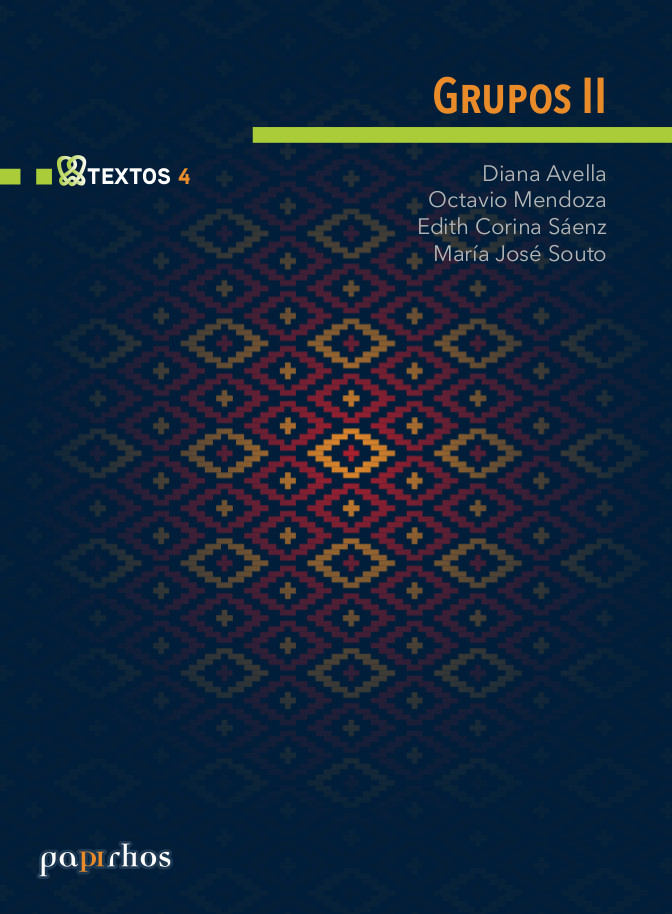

# Grupos II

🏷Textos 📚Papirhos 🗓2016 ℹ️Publicado

## Resumen
_Resumen próximamente._

## Metadatos
|  |  |
|---|---|
| **Autores** | Diana Avella, Octavio Mendoza, Edith Corina Sáenz, María José Souto | 
| **Colección** | Papirhos | 
| **Serie** | Textos | 
| **Tomo** | 2 | 
| **Año** | 2016 | 
| **Editorial** | Instituto de Matemáticas, UNAM | 
| **Edición** | 1 | 
| **ISBN (Colección)** | 978-607-02-5149-8 |

## Descargas
[Ver PDF]{{ .md-button }} [EPUB](#)
{{ .md-button }} [HTML](#)
{{ .md-button }}

!!!info "Estado de la publicación":
Publicado

## Cómo citar
> Diana Avella, Octavio Mendoza, Edith Corina Sáenz, María José Souto. (2016). *Grupos II*. Instituto de Matemáticas, UNAM, 1

[Volver al catálogo](/catalogo/)

[Explorar](/explorar/)
