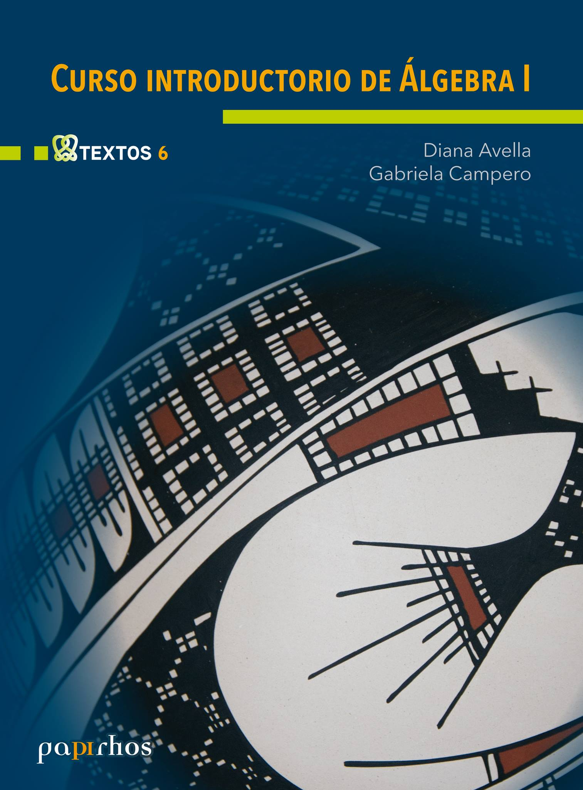

# Curso introductorio de álgebra I

🏷Textos 📚Papirhos 🗓2017 ℹ️Publicado

## Resumen
_Resumen próximamente._

## Metadatos
|  |  |
|---|---|
| **Autores** | Diana Avella, Gabriela Campero | 
| **Colección** | Papirhos | 
| **Serie** | Textos | 
| **Tomo** | 1 | 
| **Año** | 2017 | 
| **Editorial** | Instituto de Matemáticas, UNAM | 
| **Edición** | 1 | 
| **ISBN (Colección)** | 978-607-02-5149-8 |

## Descargas
<a class="md-button" href = "pap-tex-6_mark.pdf" target = "_blank" rel ="noopener"> Abrir PDF </a>
<a class="md-button" href ="pap-tex-6_mark.pdf"download> Descargar</a>

 Ver en línea (vista previa)

<object data = "pap-tex-6_mark.pdf" type="application/pdf" width="100%" height="700">

 Tu navegador no puede mostrar PDF incrustado <a href="pap-tex-6_mark.pdf" target="_blank" rel ="noopener"> Abrir PDF </a> o usa el botòn "Descargar".

</object>

!!! info "Aviso"
    documento con marca de agua para distribución **digital**.

## Cómo citar
> Diana Avella, Gabriela Campero. (2017). *Curso introductorio de álgebra I*. Instituto de Matemáticas, UNAM, 1

[Volver al catálogo](../catalogo.md)

[Explorar](../explorar.md)
